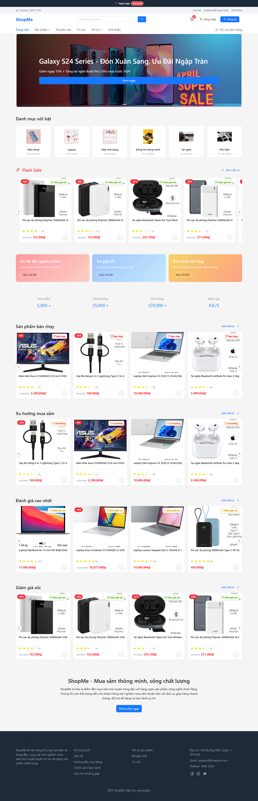

  
   
   
  Multi-module Spring Boot E-commerce Platform

# 🛒 Shopme E-Commerce Platform

    

E-commerce solution with Admin backend and Client frontend applications - **Currently under active development**

## 🌐 Live Demo

The application is available online for preview:

- **Frontend Demo**: [http://srv791694.hstgr.cloud](http://srv791694.hstgr.cloud)

> Note: Currently only the Client side is available for demo. Admin interface is under development.

## 💻 Demo Screenshots

  
   <em>Client Homepage</em>

  
   <em>Product Catalog</em>

  
   <em>Checkout Process</em>

  
   <em>Payment Options</em>

## ❓ About

Shopme is a comprehensive e-commerce platform built with Spring Boot, offering both administrative backend and customer-facing frontend applications. The system follows a multi-module architecture designed for scalability, maintainability, and best practices in e-commerce application development.

> **Development Status**: The client-side functionality is largely implemented, while the admin interface is still under active development.

## 🏛️ System Architecture

## 🧩 Module Structure

## 🔗 Project Repositories

This project is split into two separate repositories:

- **Backend (Current)**: Spring Boot API services and server-side logic
- **Frontend**: [shopme-frontend](https://github.com/thDat7/shopme-frontend) - React-based UI for both client and admin interfaces

## 💪 Features

- 🏪 **E-commerce Platform**: Full-featured online store with product catalog, shopping cart, and checkout
- 👨‍💼 **Admin Dashboard**: Comprehensive management of products, orders, customers, and settings (in development)
- 🎁 **Promotion System**: Flexible discount and promotion configurations
- 💳 **Multiple Payment Methods**: Support for COD and online banking integration
- 📱 **Responsive Design**: Works seamlessly across devices
- 🔒 **Secure Authentication**: Supporting both traditional and Google authentication
- 📦 **Docker Deployment**: Containerized for easy deployment and scaling
- ☁️ **AWS S3 Integration**: Cloud-based file storage for product images and assets
- 🔄 **Future-Ready Architecture**: Designed for easy integration with Redis, Elasticsearch and Kafka/Redis Pub/Sub

## 🚀 Technology Stack

- **Backend**: Java 17, Spring Boot 3.1.0, Spring Security, Spring Data JPA
- **Database**: MySQL 8.0
- **Cloud Services**: AWS S3 for file storage
- **Authentication**: JWT, OAuth2 with Google
- **Payment Processing**: PayOS Integration
- **Deployment**: Docker, Docker Compose
- **Future Extensions**: Redis (Caching), Elasticsearch (Search), Kafka/Redis Pub/Sub (Event Streaming)

## 🔽 Installation & Setup

You can set up Shopme by following the [prerequisites](/docs/1_prerequisites.md) and [installation guide](/docs/2_installation.md).

## 📚 Documentation

You can find the detailed [documentation](/docs/README.md) for Shopme here:

1. [💼 Prerequisites](/docs/1_prerequisites.md)
2. [⬇️ Installation](/docs/2_installation.md)
3. [🔧 Configuration](/docs/3_1_configuration.md)
4. [🚀 Deployment](/docs/3_2_deployment.md)
5. [📡 API Documentation](/docs/4_1_api_client.md)
6. [💻 Development Guide](/docs/5_development.md)
7. [👥 Troubleshooting](/docs/6_troubleshooting.md)

## 📙 Contributing

Thank you for considering contributing to Shopme.
You can find the contribution guidelines [here](/docs/CONTRIBUTING.md).

## ⚖️ License

Shopme is licensed under the Apache License, Version 2.0. Please see the [license file](LICENSE) for more information.