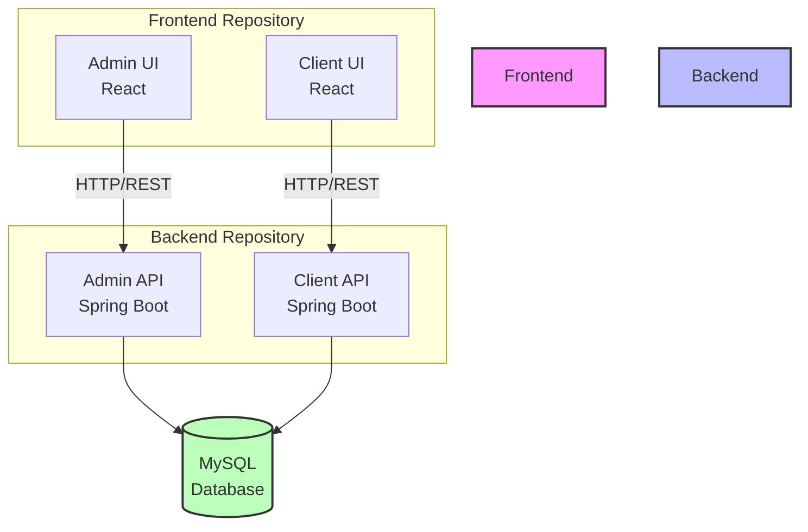
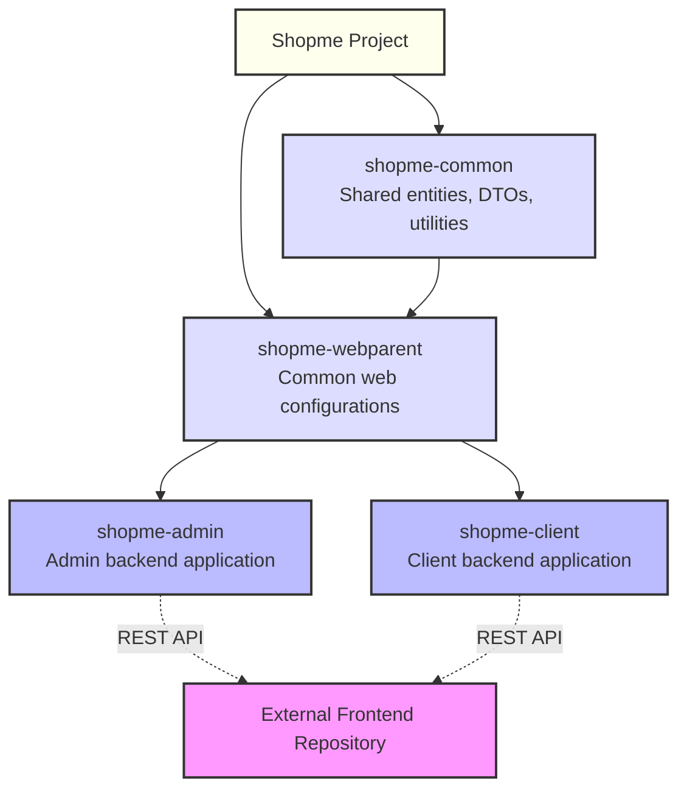
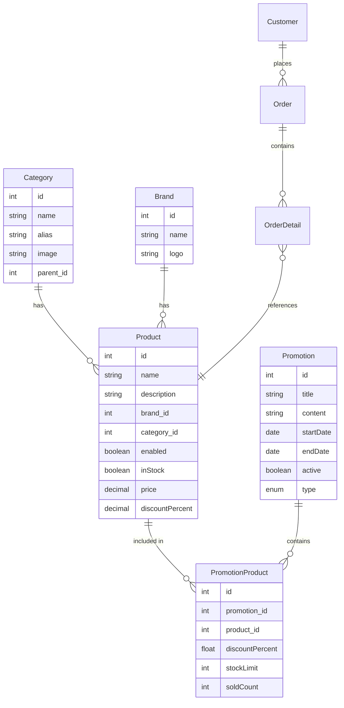
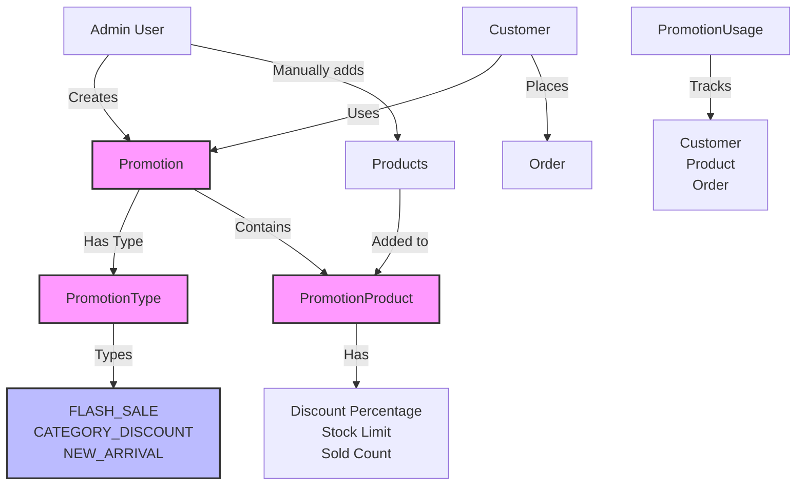
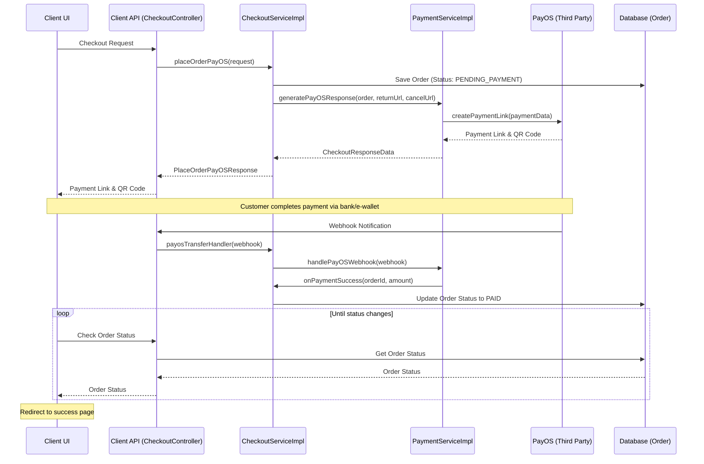
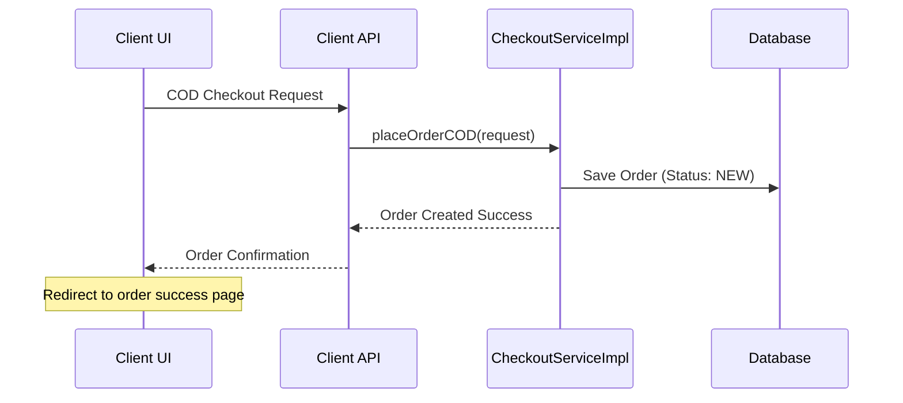
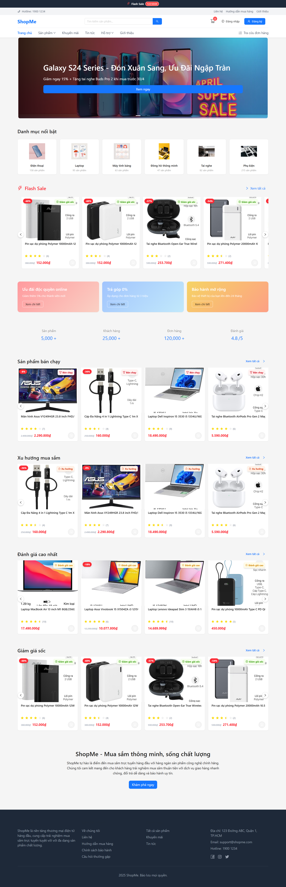
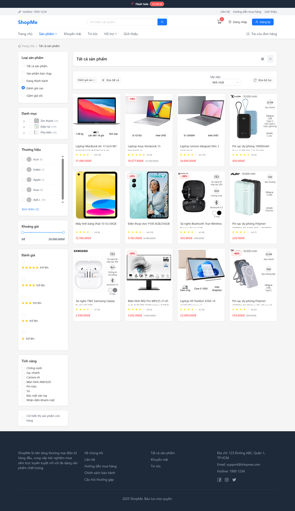
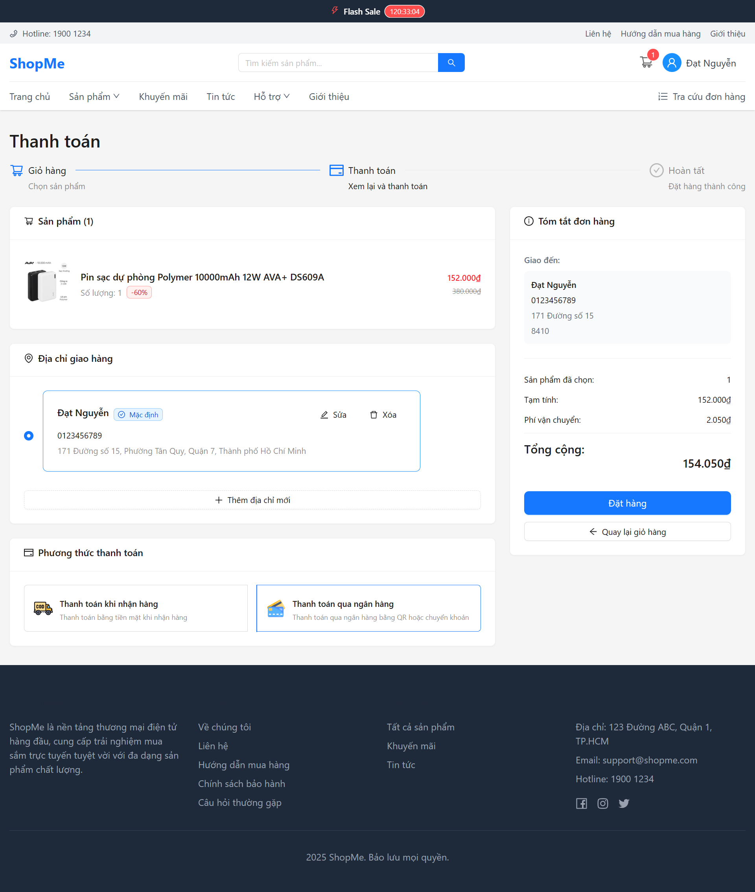
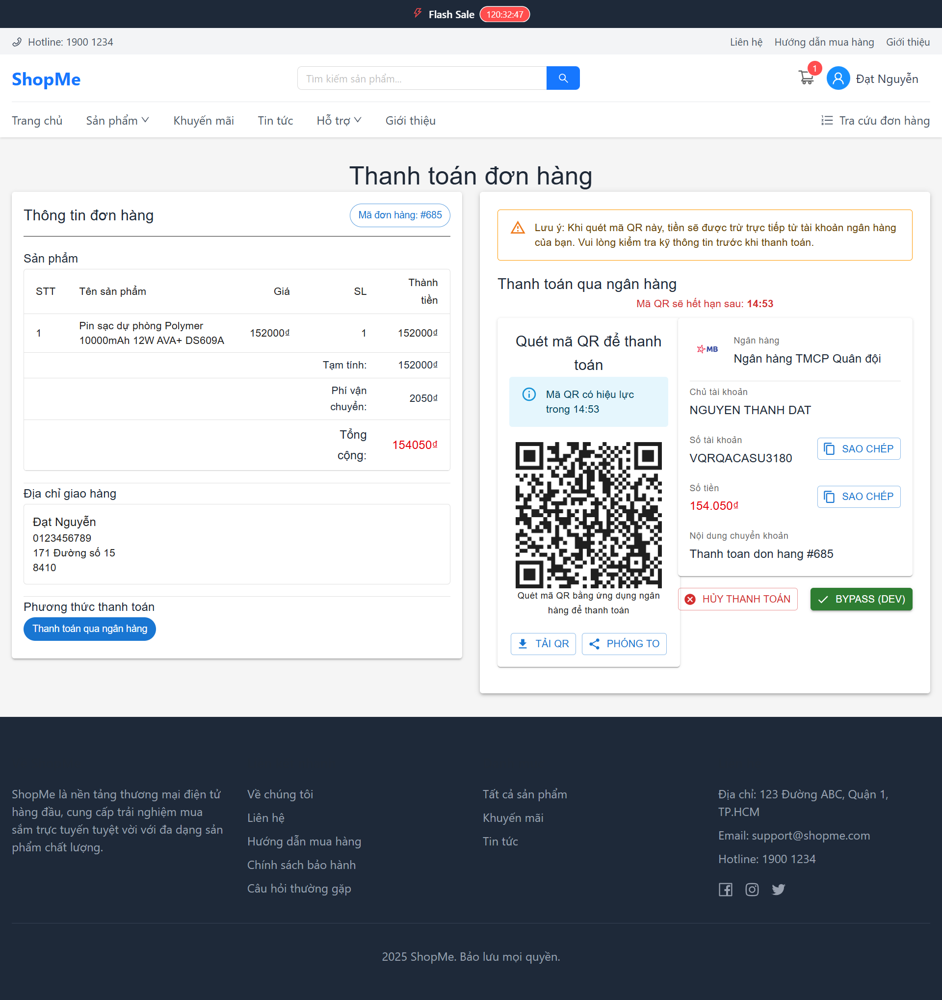

## ⚙️ Performance Optimization

- Use caching for product and category data
- Optimize database queries with proper indexing
- Use pagination for large result sets
- Minimize the size of JSON responses
- Consider using asynchronous processing for long-running tasks

## 🔍 Debugging Tips

### 1. Enable Debug Logging

```
logging.level.com.shopme=DEBUG
```

### 2. Spring Boot Developer Tools

- Automatic restart on code changes
- Enhanced error pages
- LiveReload support

### 3. Remote Debugging

```bash
mvn spring-boot:run -Dspring-boot.run.jvmArguments="-Xdebug -Xrunjdwp:transport=dt_socket,server=y,suspend=n,address=5005"
```

## 📊 System Diagrams

### 1. Architecture Diagram

Shopme follows a modern application architecture with separate backend and frontend repositories:



### 2. Module Structure



### 3. Database Entity Relationship

Simplified Entity Relationship Diagram for the core business model:



### 4. Promotion System



### 5. Checkout Sequence



For Cash-on-Delivery (COD) orders, the process is simpler:



## 📸 Screenshots

Below are some screenshots of the client application that illustrate key functionality:

### Homepage

The homepage displays featured products, promotions, and product categories:



### Product Catalog

The product catalog page with filtering, sorting, and display options:



### Checkout

The checkout interface shows order summary and payment methods (COD and Bank Payment):



### Payment

The payment interface allows users to complete payment via bank or COD:



## ⏭️ What's Next

If you encounter issues during development, the troubleshooting guide can help resolve common problems.

Continue to [❓ Troubleshooting Guide](6_troubleshooting.md)
